# 📱 App de Autenticação com React Native (Expo)

Este é um aplicativo de autenticação simples feito com **React Native** usando **Expo**, que permite:

- Registro de usuários com **e-mail**, **telefone** (com máscara brasileira) e **senha**.
- Login com e-mail e senha.
- Recuperação de senha com base no e-mail e telefone.
- Armazenamento local usando **AsyncStorage**.
- Criptografia de senhas com **SHA-256** via `crypto-js`.
- Validações de entrada (e-mail, senha forte, confirmação de senha e DDD brasileiro).

- Link do Projeto no Expo Go: [projeto](https://snack.expo.dev/@ailatan/pet-care)

---

## 🚀 Tecnologias Utilizadas

- [React Native](https://reactnative.dev/)
- [Expo](https://expo.dev/)
- [React Navigation](https://reactnavigation.org/)
- [AsyncStorage](https://react-native-async-storage.github.io/async-storage/)
- [crypto-js](https://www.npmjs.com/package/crypto-js)

---

## 📸 Capturas de Tela

**Android** | **IOS** | **WEB** | **Usuário Logado***
:--:|:--:|:--:|:--:
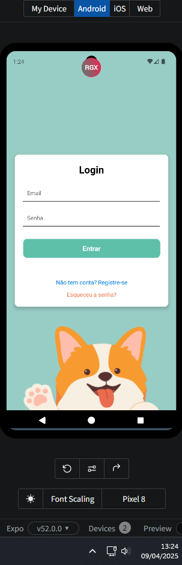 | 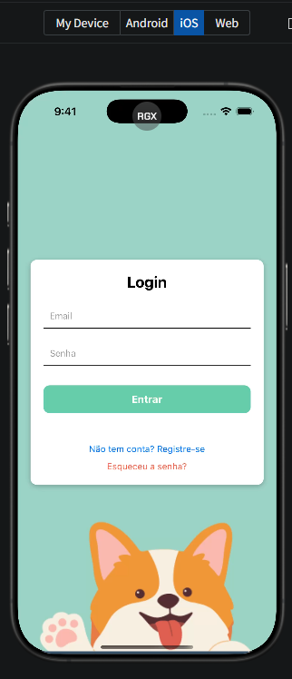 | 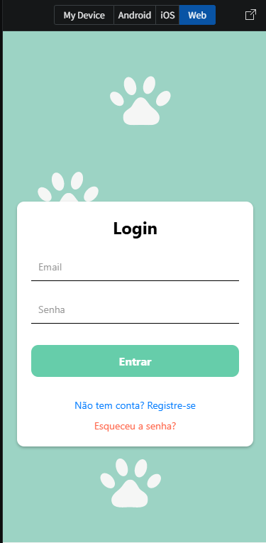 | 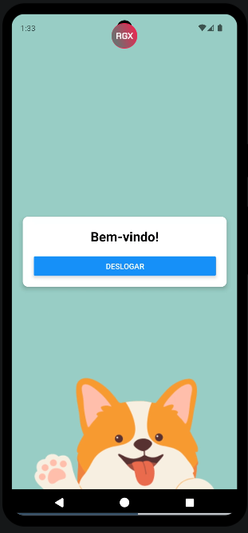

**DDD inválido** | **Recuperar Senha** | **Email ou Senha Incorretos** | **Telefone Incorreto***
:--:|:--:|:--:|:--:
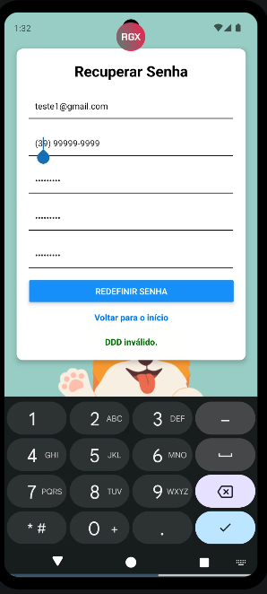 | 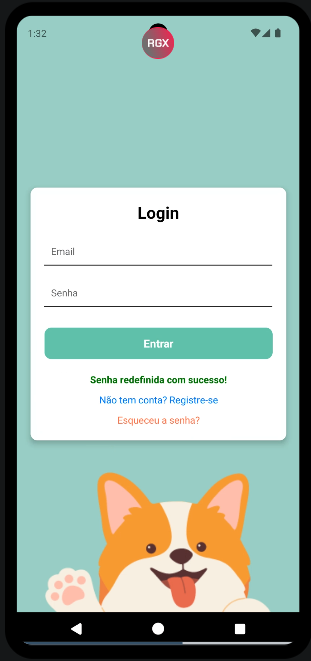 | 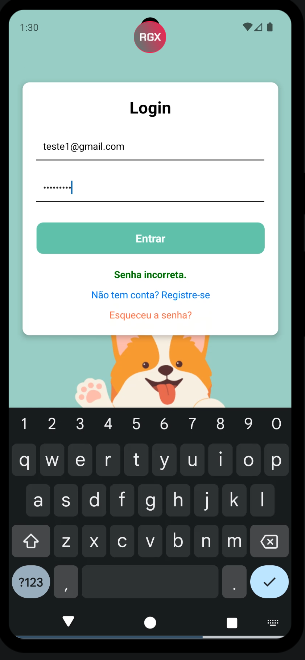 | 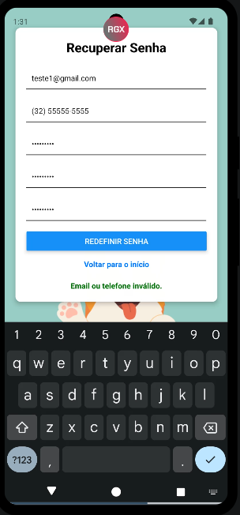

**Registro com Sucesso** | **Senhas não Coincidem** | **Senha Fora do Padrão** | **Email fora do Padrão***
:--:|:--:|:--:|:--:
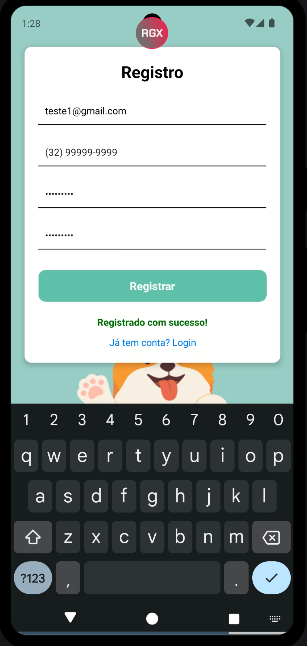 | 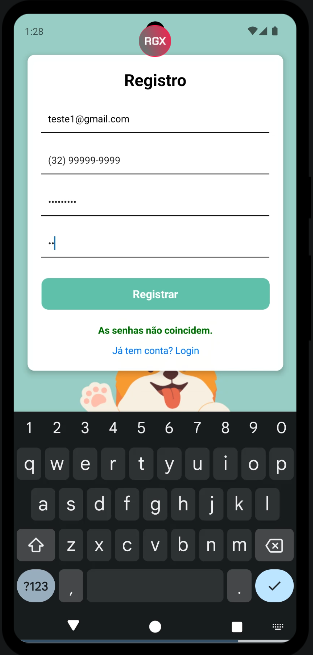 | 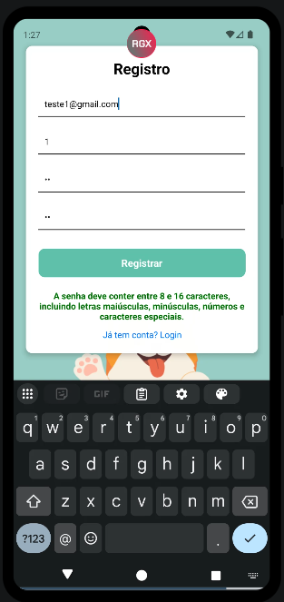 | 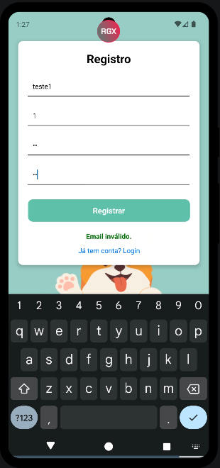

**Campos Obrigatórios** | **Usuário Não Encontrado** | **Senha Criptografada**
:--:|:--:|:--:
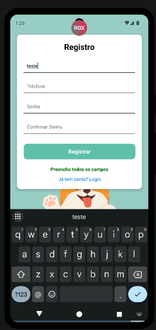 | 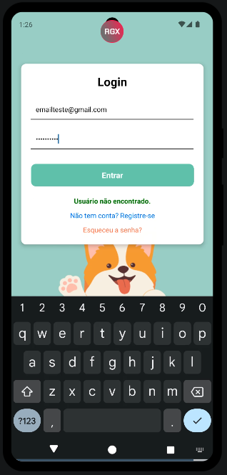 | 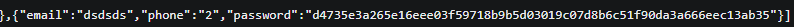 
---

## 🛠 Instalação

### 1. Pré-requisitos
- Node.js
- Expo CLI (`npm install -g expo-cli`)
- Dispositivo físico ou emulador Android/iOS
- Editor de código (VS Code recomendado)

### 2. Instale as dependências
```bash
npm install
```

---

## 🚀 Integrantes do Projeto

- Júlia Vitória
- Natália Beatriz Malta Bernini

Centro Unversitário Presidente Antônio Carlos - Barbacena

Disciplina: Programação Para Dispositivos Móveis

Orientador: Rodrigo Fernandes dos Santos

---

